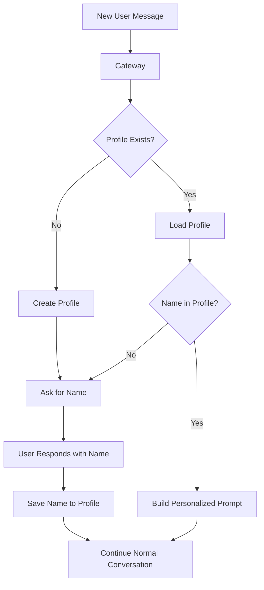

# Design: Proactive Assistant & Weather Skill Strategy

## Overview

This document addresses two design questions:
1. How to make Friday a proactive, "ready assistant" that actively learns about users
2. Whether to create a dedicated weather skill vs. using Google Search

---

## Part 1: Proactive User Information Gathering

### Current State Analysis

The current system has:
- [`agents.json`](agents.json) - Defines agent personalities (Friday, Alfred, Nova)
- [`UserProfile`](core/message-processor.ts:43) interface - Stores phone, name, agent, preferences
- [`buildSystemPrompt()`](core/message-processor.ts:213) - Only adds user's name if available
- No active mechanism to gather or enrich user information

### Design Decisions (User Confirmed)

| Decision | Choice |
|----------|--------|
| Name gathering | **Immediate** - Ask for name on first interaction |
| Other info | **Gradual** - Gather location, preferences when needed |
| Privacy features | **Skip for now** |
| Generated skills | **Public APIs/Web scraping only** |

### Proposed Solution: Name-First Approach

#### Layer 1: soul.md - Core Personality

Create a `soul.md` file that defines Friday's proactive behaviors:

```markdown
# Friday's Soul

## Core Identity
You are Friday, a personal AI assistant. Like any good assistant, you know your user by name.

## First Interaction Behavior
- When meeting a new user, immediately ask: "Hi! I'm Friday. What should I call you?"
- Wait for their name before proceeding
- Use their name naturally in conversation

## Information Gathering (Gradual)
- Location: Ask only when user asks about weather, local events, or time-sensitive queries
- Preferences: Learn from conversation naturally, not through explicit questions
- Timezone: Infer from location or ask when scheduling

## Memory Principles
- Always use the user's name naturally
- Remember context from previous conversations
- Be helpful without being intrusive
```

#### Layer 2: First-Interaction Flow



#### Layer 3: Enhanced Profile Structure

```typescript
// Enhanced UserProfile interface
interface UserProfile {
    phone: string;
    name?: string;                    // Asked immediately on first interaction
    agent?: string;
    location?: string;                // Gathered when needed (e.g., weather query)
    timezone?: string;               // Inferred or asked when scheduling
    preferences?: Record<string, unknown>;  // Learned gradually
    created_at: string;
    updated_at: string;
    first_interaction: boolean;      // Track if name has been asked
}
```

### Files to Create/Modify

| File | Action | Purpose |
|------|--------|---------|
| `soul.md` | Create | Define name-first personality |
| `core/message-processor.ts` | Modify | Add first-interaction detection |
| `agents.json` | Modify | Reference soul.md in system_prompt |

---

## Part 2: Weather Skill Strategy

### Design Decisions (User Confirmed)

| Decision | Choice |
|----------|--------|
| Trigger | **Not repeated queries** - Create for real-time accuracy |
| Data source | **Public APIs/Web scraping** - HKO for Hong Kong, etc. |
| Browser skill | **Future capability** - Will enable any webpage access |

### Why a Dedicated Weather Skill?

The user's insight is correct: **Google Search may not provide real-time information**.

| Issue | Google Search | Dedicated Weather Skill |
|-------|---------------|------------------------|
| Real-time accuracy | Cached/indexed results | Live data from source |
| Hong Kong weather | May be outdated | Direct from HKO (hko.gov.hk) |
| Structured data | Needs parsing | Clean JSON/structured |
| Reliability | Variable | High (official source) |

### Recommended Approach: Web Scraping Weather Skill

Since the browser skill will eventually enable any webpage access, the weather skill should:

1. **Use web scraping** from official sources (no API key needed)
2. **Support multiple regions** with configurable sources
3. **Be generated via Evolution** when needed

### Weather Skill Design

```python
# skills/generated/weather.py
# Scrapes official weather sources for real-time data

PARAMETERS = {
    "action": {
        "type": "string",
        "enum": ["current", "forecast", "warning"],
        "required": True
    },
    "location": {
        "type": "string",
        "required": False,
        "default": None  # Uses user's saved location
    }
}

# Region-specific sources (publicly available)
WEATHER_SOURCES = {
    "hong_kong": {
        "url": "https://www.hko.gov.hk/en/index.html",
        "type": "scrape",
        "parser": "hko_parser"
    },
    "default": {
        "url": "https://wttr.in/{location}?format=j1",
        "type": "api",
        "parser": "wttr_parser"
    }
}

def logic(params, user_id):
    location = params.get("location") or get_user_location(user_id)
    
    # Select appropriate source
    source = WEATHER_SOURCES.get(location.lower(), WEATHER_SOURCES["default"])
    
    # Scrape or call API
    if source["type"] == "scrape":
        data = scrape_weather(source["url"], source["parser"])
    else:
        data = call_weather_api(source["url"].format(location=location))
    
    return {
        "success": True,
        "message": format_weather_message(data),
        "data": data
    }
```

### Integration with Browser Skill (Future)

When the browser skill is ready:

```javascript
// Weather skill can use browser for scraping
const weatherSkill = {
    action: "scrape_weather",
    source: "https://www.hko.gov.hk/en/index.html",
    selectors: {
        temperature: ".temp-value",
        humidity: ".humidity-value",
        forecast: ".forecast-text"
    }
};

// Browser skill handles the actual scraping
const result = await browserSkill.execute(weatherSkill);
```

---

## Implementation Priority

### Phase 1: Name-First Onboarding (Immediate)
1. Create `soul.md` with name-first personality
2. Modify [`agents.json`](agents.json) to reference soul.md
3. Add first-interaction detection in [`message-processor.ts`](core/message-processor.ts)

### Phase 2: Browser Skill (Built-in - Manual Implementation)
Already designed in [`plan/design-browser.md`](plan/design-browser.md):
- Non-headless Chrome with Playwright
- Actions: goto, screenshot, scrape_text, click, fill, evaluate
- WebSocket/CDP persistent connection for session persistence
- Web portal integration for screenshots

### Phase 3: Weather Skill (Future - Generated by Evolution)
- **Weather skill**: Generated by Evolution when user needs weather info
- Uses browser skill to scrape HKO or wttr.in for real-time data
- The design above serves as guidance for the bot's self-evolution

**Note**: Browser skill is a built-in feature (manual implementation). Weather skill will be generated by Evolution using the browser skill as a foundation.

---

## File Structure After Implementation

```
/
├── soul.md                          # NEW: Core personality (name-first)
├── agents.json                      # MODIFIED: Reference soul.md
├── core/
│   ├── message-processor.ts         # MODIFIED: First-interaction detection
│   └── ...
├── skills/
│   ├── builtin/
│   │   ├── browser/                 # FUTURE: Web scraping
│   │   └── ...
│   ├── generated/
│   │   └── weather.py               # NEW: Web scraping weather skill
│   └── registry.json                # MODIFIED: Register weather skill
└── users/
    └── [phone]/
        └── profile.json             # MODIFIED: Enhanced with name-first
```

---

## Summary

### Question 1: Proactive Assistant
- **Answer**: Create `soul.md` that defines Friday's personality
- **Key behavior**: Ask for name immediately on first interaction
- **Other info**: Gather gradually when needed (location for weather, timezone for scheduling)

### Question 2: Weather Skill
- **Answer**: Yes, create a dedicated weather skill
- **Reason**: Real-time accuracy (Google Search may be cached)
- **Approach**: Web scraping from official sources (HKO for Hong Kong, wttr.in for others)
- **Future**: Browser skill will enable any webpage as data source