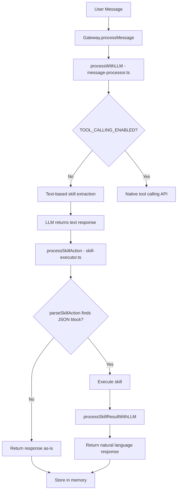

# Analysis: "No Skill Called" Issue

## Summary

After analyzing the memory log (`users/258501247037630/memory.log`), gateway logs, and source code, I found **two critical bugs**:

1. **Native Tool Calling Bug (NEW - March 31)**: When `TOOL_CALLING_ENABLED=true`, the system fails to process tool results due to empty messages causing a 400 API error.
2. **Text-Based Mode Issues (March 30)**: When using text-based skill extraction, the LLM sometimes fails to output proper skill action blocks.

## Critical Bug Found (March 31, 12:53)

### Native Tool Calling API Error

When native tool calling is enabled, the system successfully:
1. Sends request with tools (line 1087-1091)
2. LLM returns tool calls (line 1120-1121): `search({"action":"search","query":"weather today"})`
3. Tool is executed (line 1124-1128)

**BUT THEN IT FAILS:**

```
2026-03-31 12:53:44 +08:00: [LLM]   [22] assistant: 
2026-03-31 12:53:44 +08:00: [LLM]   [23] user: 
2026-03-31 12:53:44 +08:00: [LLM] API error: 400 - {"error":"Invalid 'messages' in payload. Please check the structure of your 'messages' and try again."}
```

### Root Cause: Empty Messages in API Payload

The bug is in [`message-processor.ts:577-584`](core/message-processor.ts:577):

```typescript
const finalResponse = await llmClient.chatWithContext(
    systemPrompt,
    messagesWithTools.slice(0, -toolResultMessages.length), // History without tool results
    '', // Empty user message since we're continuing  <-- THIS IS THE BUG
    {
        temperature: options?.temperature ?? 0.7,
        maxTokens: options?.maxTokens ?? 2048,
    }
);
```

The `chatWithContext()` function adds `{ role: 'user', content: '' }` to messages (line 394 in llm-client.ts), and LM Studio API rejects empty messages.

## Evidence of Skill Execution (March 30)

From gateway logs, skills ARE being executed successfully:

```
2026-03-30 14:25:04: [Skill] Executing search.search for user 258501247037630
2026-03-30 14:25:05: [Skill] search executed successfully
2026-03-30 15:41:15: [Skill] Executing search.search for user 258501247037630
2026-03-30 15:41:16: [Skill] search executed successfully
2026-03-30 17:26:26: [Skill] Executing search.search for user 258501247037630
2026-03-30 17:43:19: [Skill] Executing browser.goto for user 258501247037630
```

## Problem Patterns Identified

### Pattern 1: LLM Treats User Messages as Search Queries

**Memory Log Lines 59-79:**
```json
{"timestamp":"2026-03-30T15:52:46.695Z","role":"user","content":"Please try again"}
{"timestamp":"2026-03-30T15:53:05.430Z","role":"assistant","content":"I searched for \"Please try again\" but couldn't find clear results..."}
```

The LLM is treating conversational messages like "Please try again" as search queries instead of understanding context.

### Pattern 2: LLM Outputs Skill Action Blocks But They're Not Executed

**Memory Log Line 53:**
```json
{"timestamp":"2026-03-30T10:54:10.952Z","role":"assistant","content":"Hi Thomas! Since you're in Hong Kong...\n\n{{\n  \"action\": \"goto\",\n  \"skill\": \"browser\",\n  \"params\": {...}\n}}"}
```

The LLM outputted a valid skill action block in `{{...}}` format, but it was stored in memory as-is, meaning the skill was NOT executed.

### Pattern 3: Raw JSON Results Returned Instead of Natural Language

**Memory Log Line 5:**
```json
{"timestamp":"2026-03-30T06:25:05.883Z","role":"assistant","content":"{\"success\":true,\"message\":\"🔍 Found 10 results..."}
```

The skill executed successfully, but the raw JSON result was returned to the user instead of being processed into natural language.

## Root Cause Analysis

### 1. TOOL_CALLING_ENABLED Not Set

The `.env` file does NOT have `TOOL_CALLING_ENABLED=true`, so the system uses **text-based skill extraction** mode instead of native tool calling.

**Impact:** The LLM must output JSON action blocks in its response text, which are then parsed by [`parseSkillAction()`](core/skill-executor.ts:126). This is less reliable than native tool calling.

### 2. Model Capability Issues

The model `qwen/qwen3.5-35b-a3b` may not consistently follow the skill prompts in the system prompt. Evidence:
- Sometimes outputs skill action blocks correctly
- Sometimes ignores the skill system prompt entirely
- Sometimes treats user messages as literal search queries

### 3. Context Pollution

The conversation history contains many failed attempts and confusing exchanges, which may confuse the LLM:
```
User: "Please try again"
Assistant: "I searched for 'Please try again' but couldn't find clear results..."
User: "Please try again"
Assistant: "I searched for 'Please try again' but couldn't find clear results..."
```

This creates a feedback loop where the LLM learns incorrect behavior.

### 4. Skill Action Block Parsing Edge Cases

The [`parseSkillAction()`](core/skill-executor.ts:126) function handles `{{...}}` double-brace format, but there may be edge cases where:
- The JSON inside the braces is malformed
- The action block is mixed with other text
- The regex doesn't match correctly

## Architecture Flow



## Recommendations

### Fix 1: Native Tool Calling Bug (CRITICAL - Must Fix First)

**Problem:** Empty user message causes API 400 error when processing tool results.

**Location:** [`core/message-processor.ts:577-584`](core/message-processor.ts:577)

**Current Code:**
```typescript
const finalResponse = await llmClient.chatWithContext(
    systemPrompt,
    messagesWithTools.slice(0, -toolResultMessages.length),
    '', // <-- BUG: Empty user message
    { temperature: options?.temperature ?? 0.7, maxTokens: options?.maxTokens ?? 2048 }
);
```

**Solution:** Use a direct chat completion method that accepts the full message array including tool results, instead of `chatWithContext()` which adds an empty user message.

**Recommended Fix:**
```typescript
// Build complete message array with tool results
const messagesWithToolResults: ChatMessage[] = [
    { role: 'system', content: systemPrompt },
    ...history,
    { role: 'user', content: message },
    { role: 'assistant', content: response.content, tool_calls: response.toolCalls },
    ...toolResultMessages.map(tr => ({
        role: 'tool' as const,
        content: tr.content,
        tool_call_id: tr.tool_call_id,
    })),
];

// Use chatCompletion directly, not chatWithContext
const finalResponse = await llmClient.chatCompletion({
    messages: messagesWithToolResults,
    temperature: options?.temperature ?? 0.7,
    maxTokens: options?.maxTokens ?? 2048,
});
```

### Fix 2: Add Validation for Empty Messages

Add validation in [`llm-client.ts`](core/llm-client.ts) to filter out empty messages before sending to API:

```typescript
// Filter out empty messages before sending to API
const validMessages = messages.filter(m => 
    m.content && m.content.trim() !== '' || 
    m.tool_calls || 
    m.role === 'tool'
);
```

### Fix 3: Clear Polluted Context

The user's memory.log contains many failed exchanges that confuse the LLM. Clear or truncate the memory to remove the feedback loop.

## Immediate Actions

1. **Fix the native tool calling bug** in `message-processor.ts` - use `chatCompletion()` directly instead of `chatWithContext()`
2. **Add empty message validation** in `llm-client.ts`
3. **Clear the user's memory.log** to remove confusing context
4. **Test the fix** with `TOOL_CALLING_ENABLED=true`

## Code References

- **Bug location:** [`core/message-processor.ts:577-584`](core/message-processor.ts:577)
- **chatWithContext adds empty message:** [`core/llm-client.ts:391-395`](core/llm-client.ts:391)
- **Tool result formatting:** [`core/skill-executor.ts:400-408`](core/skill-executor.ts:400)
- **Tool calling config:** [`core/tool-calling.ts:36-47`](core/tool-calling.ts:36)