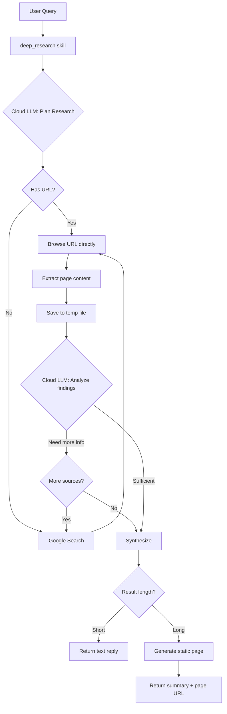
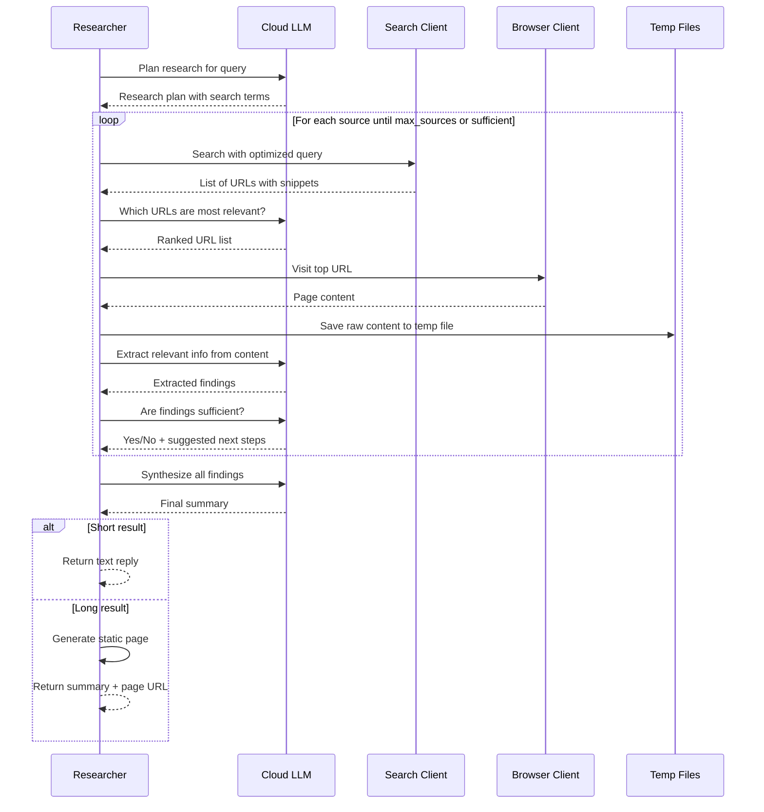

# Deep Research Skill - Design Plan

## Overview

A new **`deep_research`** skill that combines Google Search + Browser + Cloud LLM to autonomously deep-dive into topics and return verified, synthesized information. The skill uses a cloud LLM to plan, execute, and reason about research steps — no hardcoded logic.

## Motivation

The existing agent loop (`AGENT_MAX_ITERATIONS=5`) is designed for quick tool chains. Deep research needs:
- More iterations (visit multiple pages, cross-reference)
- Cloud LLM reasoning for deciding what to search and whether info is sufficient
- Temp file management for intermediate data
- Smart output: short text reply or static page for long results

## Architecture



## Key Design Decisions

### 1. Self-contained Python skill with internal LLM loop

The skill runs its own agent loop internally using a **configurable LLM** (any OpenAI-compatible or Ollama API). This is separate from the main gateway agent loop.

**Why not use the main agent loop?**
- Main loop limited to 5 iterations — research may need 10+
- Research needs specialized system prompts for each step
- Temp file management across iterations
- Cloud LLM provides better reasoning for research decisions

### 2. Standalone skill — no dependencies on other skills

All three skills (`search`, `browser`, `deep_research`) are fully standalone:
- `search` — for simple direct searches (gateway LLM calls it directly)
- `browser` — for simple direct browsing (gateway LLM calls it directly)
- `deep_research` — for multi-step research with LLM reasoning (has its own search and browser code)

`deep_research` has its own `search_client.py` and `browser_client.py` — it does NOT spawn the existing JS skills.

**Why standalone?**
- No cross-skill dependencies or coupling
- Simpler error handling and state management
- Deep research needs tighter control over multi-page navigation
- Each skill can evolve independently

### 3. Cloud LLM for reasoning

Uses a generic `call_llm()` function (configuration-driven, supporting any OpenAI-compatible or Ollama API) for:
- Planning research strategy from user query
- Deciding if findings are sufficient or more sources needed
- Synthesizing final summary from collected data
- Determining output format (text vs. static page)

## File Structure

```
skills/builtin/deep_research/
├── skill.json           # Skill definition for registry
├── index.py             # Main entry point (stdin/stdout pattern)
├── researcher.py        # Core research orchestration with LLM loop
├── search_client.py     # Google Custom Search API client
├── browser_client.py    # Playwright browser automation
├── prompts.py           # LLM prompt templates
├── requirements.txt     # Python dependencies
└── README.md            # Skill documentation
```

## Detailed Component Design

### skill.json

```json
{
  "id": "deep_research",
  "name": "Deep Research",
  "description": "Deep dive research combining search, browser, and LLM reasoning to find verified information",
  "file": "index.py",
  "type": "builtin",
  "prompt": "... detailed prompt for the gateway LLM ...",
  "parameters": {
    "action": {
      "type": "string",
      "enum": ["research", "analyze_url", "status"],
      "required": true,
      "description": "Action to perform"
    },
    "query": {
      "type": "string",
      "description": "Research query (required for research action)"
    },
    "url": {
      "type": "string",
      "description": "URL to analyze (required for analyze_url action)"
    },
    "mode": {
      "type": "string",
      "enum": ["quick", "deep"],
      "default": "deep",
      "description": "Research depth: quick=1-2 sources, deep=3-5 sources"
    },
    "max_sources": {
      "type": "number",
      "default": 5,
      "description": "Maximum number of sources to visit"
    }
  }
}
```

### Actions

| Action | Description |
|--------|-------------|
| `research` | Full research: search → browse → extract → synthesize |
| `analyze_url` | Analyze a specific URL: browse → extract → optionally follow links → synthesize |
| `status` | Check skill configuration and dependencies |

### search_client.py

Python wrapper for Google Custom Search API — mirrors the logic in [`google-api.js`](skills/builtin/search/google-api.js):

- `search(query, num_results=5)` → returns list of `{title, url, snippet}`
- Uses `GOOGLE_SEARCH_API_KEY` and `GOOGLE_SEARCH_CX` from env
- In-memory cache with 5-minute TTL
- Error handling for rate limits and invalid queries

### browser_client.py

Playwright-based browser automation — mirrors core functionality from [`chrome-manager.js`](skills/builtin/browser/chrome-manager.js) and [`actions.js`](skills/builtin/browser/actions.js):

- `browse_url(url)` → navigate and extract text content
- `get_links()` → extract links from current page
- `get_page_title()` → get page title
- `scrape_text()` → extract readable text content
- Connects to existing Chrome on CDP endpoint `localhost:9222` (same as existing browser skill)
- Falls back to launching Chromium if no existing instance

### prompts.py

Prompt templates for the cloud LLM at each research stage:

1. **PLAN_PROMPT** — Analyze query and create research plan
2. **ANALYZE_PAGE_PROMPT** — Extract relevant info from a page given the query
3. **EVALUATE_PROMPT** — Decide if current findings are sufficient
4. **SYNTHESIZE_PROMPT** — Create final summary from all findings
5. **FORMAT_DECISION_PROMPT** — Decide output format based on result length

### researcher.py

Core orchestration engine:

```python
class DeepResearcher:
    def __init__(self, query, mode, max_sources):
        self.query = query
        self.mode = mode
        self.max_sources = max_sources
        self.findings = []        # Collected data from each source
        self.temp_dir = None      # Temp directory for this research session
        self.visited_urls = set()  # Track visited URLs to avoid loops
    
    async def research(self) -> ResearchResult:
        # 1. Create temp directory
        # 2. Call cloud LLM to plan research
        # 3. Execute research loop:
        #    a. Search for sources (if no URL provided)
        #    b. Visit each source
        #    c. Extract content
        #    d. Save to temp file
        #    e. Cloud LLM evaluates if more research needed
        # 4. Synthesize findings
        # 5. Format output (text or static page)
        # 6. Cleanup temp files
```

### Research Loop Flow



## Output Strategy

| Condition | Output |
|-----------|--------|
| Summary < 1000 chars | Plain text reply |
| Summary >= 1000 chars | Static page + short text summary with URL |
| Multiple sources with detailed data | Static page with sources section |

For static page generation, the skill spawns the existing `static_page` skill as a subprocess, passing the synthesized data.

## Temp File Management

- Location: `./temp/deep_research/{session_id}/`
- Each source gets a numbered file: `source_01.json`, `source_02.json`, etc.
- Format: `{"url": "...", "title": "...", "content": "...", "findings": "...", "timestamp": "..."}`
- Cleanup after research completes (or on error)
- Max age cleanup by janitor (if session crashes)

## Configuration (Environment Variables)

```bash
# Deep Research - LLM Configuration (generic, any OpenAI-compatible or Ollama API)
DEEP_RESEARCH_LLM_MODEL=qwen/qwen3.5-35b-a3b
DEEP_RESEARCH_LLM_BASE_URL=http://localhost:1234/v1
DEEP_RESEARCH_LLM_API_TYPE=openai    # "openai" or "ollama"
DEEP_RESEARCH_LLM_API_KEY=           # Optional API key for cloud providers

# Deep Research - Behavior
DEEP_RESEARCH_MAX_SOURCES=5
DEEP_RESEARCH_MAX_ITERATIONS=10
DEEP_RESEARCH_TIMEOUT_MS=120000
DEEP_RESEARCH_TEMP_DIR=./temp/deep_research
```

The LLM client in `researcher.py` will be a generic `call_llm()` function that:
- Reads `DEEP_RESEARCH_LLM_API_TYPE` to determine request format (OpenAI vs Ollama)
- Reads `DEEP_RESEARCH_LLM_BASE_URL` and `DEEP_RESEARCH_LLM_MODEL` for endpoint config
- Optionally uses `DEEP_RESEARCH_LLM_API_KEY` for authenticated cloud APIs
- No model-specific logic — purely configuration-driven

## Dependencies (requirements.txt)

```
requests>=2.31.0
playwright>=1.40.0
python-dotenv>=1.0.0
```

## Integration with Gateway

The skill integrates like any other skill:
1. Gateway LLM sees `deep_research` in the tool list
2. When user asks a research-worthy question, LLM calls `deep_research`
3. Skill runs (may take 30-120 seconds)
4. Result returned to gateway LLM
5. Gateway LLM formats and sends to user

**Important**: For long research tasks, the triage system should classify these as `background_task` so the user gets a quick acknowledgment while research runs. The task manager already supports this pattern.

## Prompt for Gateway LLM (in skill.json)

The `prompt` field in `skill.json` should guide the gateway LLM on when and how to use this skill:

```
Use deep_research when the user asks questions that require:
- Current/real-time information (news, weather, stock prices)
- Multi-source verification
- Detailed analysis of a topic
- Summarization of web content
- Analysis of a specific URL

Actions:
- research: For general queries → {"action": "research", "query": "...", "mode": "quick|deep"}
- analyze_url: For specific URLs → {"action": "analyze_url", "url": "...", "query": "what to find"}
- status: Check configuration → {"action": "status"}

Use "quick" mode for simple factual questions (weather, price).
Use "deep" mode for complex research (news summary, comparison, analysis).
```

## Error Handling

| Scenario | Handling |
|----------|----------|
| Search API unavailable | Return error, suggest retry |
| Browser fails to load page | Skip source, try next |
| Cloud LLM timeout | Retry once, then return partial findings |
| All sources fail | Return error with search results as fallback |
| Temp file write fails | Log error, continue without saving |
| Research exceeds max iterations | Return best findings so far |

## Security Considerations

- No execution of arbitrary JavaScript from visited pages
- URL validation before browsing (no file://, no internal IPs)
- Temp files cleaned up after research
- Rate limiting on search API calls
- Max content size per page (truncate at 50KB text)
