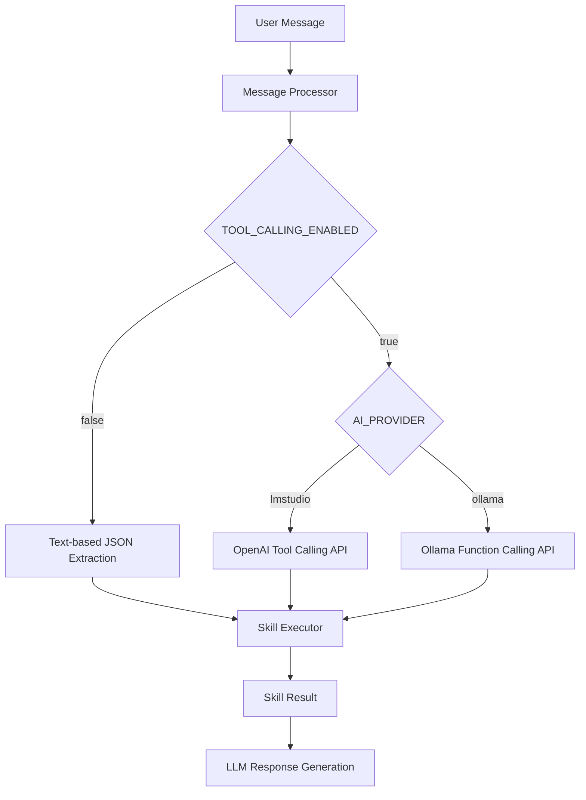
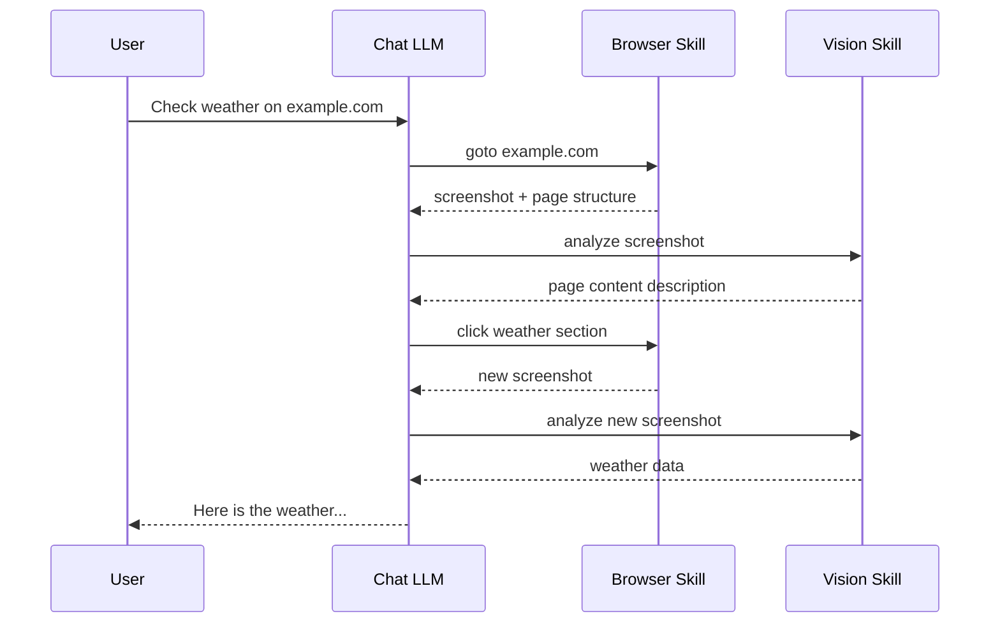

# Design: Tool Calling and Vision Model Integration

## Overview

This document outlines the implementation plan for three major enhancements to Project Friday:

1. **Tool Calling Feature** - Add support for native LLM tool calling (enable/disable via env)
2. **Vision Model Integration** - Add a dedicated vision model for image analysis
3. **Skill Independence** - Ensure skills remain independent with LLM orchestration

---

## 1. Tool Calling Feature

### 1.1 Current Implementation

Currently, the system extracts skill actions from LLM text responses using JSON parsing:

```
LLM Response → parseSkillAction() → Extract JSON block → Execute skill
```

The LLM is prompted to respond with JSON action blocks like:
```json
{"action": "goto", "skill": "browser", "params": {"url": "https://example.com"}}
```

### 1.2 New Implementation

#### Environment Variables

```bash
# Enable tool calling (false = use text extraction, true = use native tool calling)
TOOL_CALLING_ENABLED=false

# Provider determines the tool calling format automatically
AI_PROVIDER=lmstudio  # Uses OpenAI-style tools format with JSON Schema
AI_PROVIDER=ollama   # Uses Ollama function calling format
```

| TOOL_CALLING_ENABLED | AI_PROVIDER | Behavior |
|---------------------|-------------|----------|
| `false` | any | Text extraction (current implementation) |
| `true` | `lmstudio` | OpenAI-style tool calling with JSON Schema |
| `true` | `ollama` | Ollama function calling format |

**Note:** JSON Schema (`response_format: { type: "json_object" }`) is a separate feature for structured output and is NOT the same as tool calling. This plan focuses on tool calling only.

#### Architecture Changes



#### Implementation Details

**File: `core/llm-client.ts`**

Add new interfaces and methods for tool calling:

```typescript
// New interfaces
interface ToolDefinition {
    type: 'function';
    function: {
        name: string;
        description: string;
        parameters: Record<string, unknown>;
    };
}

interface ToolCall {
    id: string;
    type: 'function';
    function: {
        name: string;
        arguments: string; // JSON string
    };
}

// New method in LLMClient
async chatWithTools(options: {
    messages: ChatMessage[];
    tools: ToolDefinition[];
    toolChoice?: 'auto' | 'none' | { type: 'function'; function: { name: string } };
}): Promise<{
    content: string;
    toolCalls?: ToolCall[];
    success: boolean;
}>
```

**File: `core/tool-calling.ts` (New)**

```typescript
// Check if tool calling is enabled
function isToolCallingEnabled(): boolean;

// Get the appropriate tool format based on provider
function getToolFormat(): 'openai' | 'ollama';

// Convert skill registry to tool definitions based on provider
function skillsToTools(provider: 'openai' | 'ollama'): ToolDefinition[];

// Parse tool call response based on provider format
function parseToolCall(toolCall: ToolCall, provider: 'openai' | 'ollama'): SkillAction;
```

**File: `core/message-processor.ts`**

Modify `processMessage()` to:
1. Check `TOOL_CALLING_ENABLED` environment variable
2. If `false`, use current text extraction implementation
3. If `true`, check `AI_PROVIDER` and use appropriate tool calling format

#### Tool Format Differences

**OpenAI-style (LM Studio):**
```json
{
    "type": "function",
    "function": {
        "name": "browser_goto",
        "description": "Navigate to a URL",
        "parameters": {
            "type": "object",
            "properties": {
                "url": { "type": "string", "description": "URL to navigate to" }
            },
            "required": ["url"]
        }
    }
}
```

**Ollama-style:**
```json
{
    "type": "function",
    "function": {
        "name": "browser_goto",
        "description": "Navigate to a URL",
        "parameters": {
            "url": { "type": "string", "description": "URL to navigate to" }
        }
    }
}
```

Note: Ollama uses a simpler schema format without JSON Schema keywords like `type: object`, `properties`, etc.

---

## 2. Vision Model Integration

### 2.1 Environment Variables

```bash
# Vision model configuration
VISION_MODEL=llava:13b
# Optional: Different endpoint for vision (defaults to AI_BASE_URL)
VISION_BASE_URL=http://localhost:11434
```

### 2.2 New Vision Skill

**File: `skills/builtin/vision/index.py` (New)**

```python
#!/usr/bin/env python3
"""
Vision Skill - Image Analysis for Friday

Provides image analysis capabilities using a dedicated vision model.
Supports both local files and URLs.
"""

def analyze_image(image_path: str, query: str) -> dict:
    """
    Analyze an image with a vision model.
    
    Args:
        image_path: Path to local file or URL
        query: Question or instruction about the image
    
    Returns:
        {
            "success": bool,
            "message": str,  # Analysis result
            "data": {...}
        }
    """
```

**Actions:**
- `analyze` - Analyze an image with a query
- `describe` - Get a general description of an image

**Parameters:**
```json
{
    "action": {
        "type": "string",
        "enum": ["analyze", "describe"],
        "required": true
    },
    "image_path": {
        "type": "string",
        "description": "Path to local file or URL"
    },
    "query": {
        "type": "string",
        "description": "Question or instruction about the image"
    }
}
```

### 2.3 Vision Client

**File: `core/vision-client.ts` (New)**

```typescript
/**
 * Vision Client for Friday
 * 
 * Handles communication with vision models (LLaVA, etc.)
 */

interface VisionRequest {
    image: string;  // Base64 or URL
    prompt: string;
}

interface VisionResponse {
    description: string;
    success: boolean;
    error?: string;
}

export class VisionClient {
    private baseUrl: string;
    private model: string;
    
    constructor(baseUrl?: string, model?: string);
    
    async analyzeImage(imagePath: string, query: string): Promise<VisionResponse>;
    async encodeImage(imagePath: string): Promise<string>;  // Base64 encode
    async isAvailable(): Promise<boolean>;
}
```

### 2.4 Integration Flow



**Key Points:**
- LLM decides when to use vision skill
- No automatic screenshot analysis
- Browser skill returns screenshot path, LLM chooses to analyze or not
- Skills remain independent

---

## 3. Skill Independence

### 3.1 Current State

Skills are already independent:
- Each skill is a standalone script (Python/JavaScript)
- Skills communicate via JSON stdin/stdout
- No direct skill-to-skill communication

### 3.2 Design Principles

1. **Single Responsibility**: Each skill does one thing well
2. **No Skill Chaining**: Skills don't call other skills
3. **LLM Orchestration**: The chat model decides how to combine skills
4. **Stateless Operations**: Skills maintain minimal state

### 3.3 Browser Skill Modifications

**Current behavior:**
- Browser skill includes screenshot in response for vision models
- Some automatic integration exists

**New behavior:**
- Browser skill returns:
  ```json
  {
      "success": true,
      "message": "Navigated to example.com",
      "data": {
          "url": "https://example.com",
          "title": "Example Domain",
          "screenshot_path": "/temp/screenshots/abc123.png",
          "structure": { ... }
      }
  }
  ```
- LLM receives this and decides next action
- LLM may call vision skill with `screenshot_path`

### 3.4 Registry Update

**File: `skills/registry.json`**

Add vision skill:
```json
{
    "vision": {
        "name": "Vision Analysis",
        "description": "Analyze images using a vision model. Use this to read screenshots, photos, or any image content.",
        "file": "/skills/builtin/vision/index.py",
        "type": "builtin",
        "parameters": {
            "action": {
                "type": "string",
                "enum": ["analyze", "describe"],
                "required": true,
                "description": "Action to perform"
            },
            "image_path": {
                "type": "string",
                "description": "Path to local image file or URL"
            },
            "query": {
                "type": "string",
                "description": "Question or instruction about the image"
            }
        }
    }
}
```

---

## 4. Implementation Plan

### Phase 1: Tool Calling Infrastructure

1. Add `TOOL_CALLING_ENABLED` to `.env.example`
2. Create `core/tool-calling.ts` with provider detection and tool conversion
3. Modify `core/llm-client.ts` to support tool calling API
4. Update `core/message-processor.ts` to use tool calling when enabled
5. Add unit tests for tool calling

### Phase 2: Vision Model Integration

1. Add `VISION_MODEL` and `VISION_BASE_URL` to `.env.example`
2. Create `core/vision-client.ts` for vision model communication
3. Create `skills/builtin/vision/index.py` skill
4. Add vision skill to `skills/registry.json`
5. Add unit tests for vision client

### Phase 3: Browser Skill Updates

1. Modify browser skill to return screenshot path in response
2. Remove any automatic vision integration
3. Update browser skill documentation in registry
4. Add tests for updated browser skill

### Phase 4: System Prompt Updates

1. Update `generateSkillsPrompt()` in `message-processor.ts`
2. Add vision skill documentation to system prompt
3. Update tool calling prompts for different providers
4. Test end-to-end flows

---

## 5. File Changes Summary

### New Files
- `core/tool-calling.ts` - Tool calling mode handling
- `core/vision-client.ts` - Vision model client
- `skills/builtin/vision/index.py` - Vision skill implementation

### Modified Files
- `.env.example` - Add new environment variables
- `core/llm-client.ts` - Add tool calling support
- `core/message-processor.ts` - Integrate tool calling and vision
- `core/skill-executor.ts` - Handle tool call responses
- `skills/registry.json` - Add vision skill
- `skills/builtin/browser/index.js` - Return screenshot path

### Test Files
- `core/__tests__/tool-calling.test.ts`
- `core/__tests__/vision-client.test.ts`
- `core/__tests__/llm-client.test.ts` - Update for tool calling

---

## 6. Environment Variables Summary

```bash
# === TOOL CALLING ===
# Enable native tool calling (false = text extraction, true = tool calling API)
TOOL_CALLING_ENABLED=false

# === VISION MODEL ===
# Vision model name (e.g., llava:13b, moondream)
VISION_MODEL=llava:13b
# Optional: Different endpoint for vision (defaults to AI_BASE_URL)
VISION_BASE_URL=http://localhost:11434
```

---

## 7. Example Flows

### Example 1: Weather Check with Vision

```
User: What's the weather on weather.com?

LLM → Browser: goto https://weather.com
Browser → LLM: { screenshot_path: "/temp/abc.png", structure: {...} }
LLM → Vision: analyze /temp/abc.png - What is the weather shown?
Vision → LLM: "The image shows temperature 72°F, partly cloudy..."
LLM → User: The current weather is 72°F and partly cloudy.
```

### Example 2: Tool Calling with OpenAI Format (LM Studio)

```
LLM Request:
POST /chat/completions
{
    "model": "qwen/qwen3.5-35b-a3b",
    "messages": [...],
    "tools": [
        {
            "type": "function",
            "function": {
                "name": "browser_goto",
                "description": "Navigate to a URL",
                "parameters": {
                    "type": "object",
                    "properties": {
                        "url": { "type": "string" }
                    },
                    "required": ["url"]
                }
            }
        }
    ],
    "tool_choice": "auto"
}

LLM Response:
{
    "choices": [{
        "message": {
            "tool_calls": [{
                "id": "call_123",
                "type": "function",
                "function": {
                    "name": "browser_goto",
                    "arguments": "{\"url\": \"https://weather.com\"}"
                }
            }]
        }
    }]
}
```

### Example 3: Tool Calling with Ollama Format

```
LLM Request:
POST /api/chat
{
    "model": "llama3.1",
    "messages": [...],
    "tools": [
        {
            "type": "function",
            "function": {
                "name": "browser_goto",
                "description": "Navigate to a URL",
                "parameters": {
                    "url": { "type": "string" }
                }
            }
        }
    ]
}

LLM Response:
{
    "message": {
        "tool_calls": [{
            "function": {
                "name": "browser_goto",
                "arguments": { "url": "https://weather.com" }
            }
        }]
    }
}
```

---

## 8. Risks and Mitigations

| Risk | Mitigation |
|------|------------|
| Tool calling not supported by model | Graceful fallback to text mode with warning |
| Vision model unavailable | Return error message, LLM can try alternative |
| Screenshot files accumulate | Janitor process cleans up old screenshots |
| Tool calling adds latency | Cache tool definitions, optimize API calls |

---

## 9. Testing Strategy

1. **Unit Tests**: Test each component in isolation
2. **Integration Tests**: Test tool calling flow end-to-end
3. **Manual Testing**: Test with different LLM backends (LM Studio, Ollama)
4. **Performance Tests**: Measure latency impact of tool calling

---

## 10. Documentation Updates

- Update `README.md` with new environment variables
- Add tool calling usage examples
- Document vision skill capabilities
- Update architecture diagrams