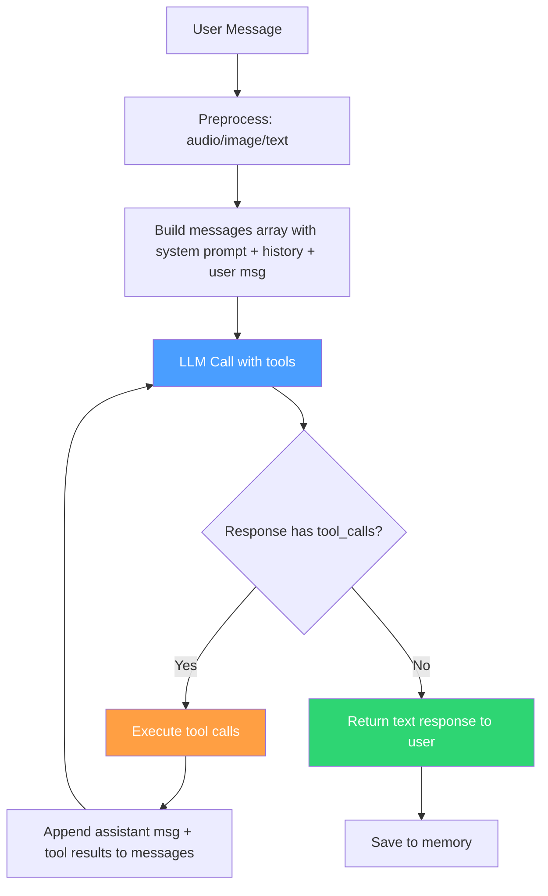
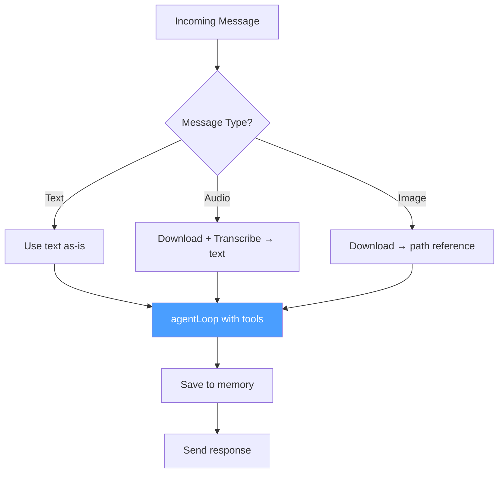

# Gateway Refactoring: Replace Hardcoded Flows with LLM Agent Loop

## Problem Summary

The gateway has 4 major architectural flaws that make the LLM "stupid":

### 1. No Agent Loop — Single Tool Call Only

The current flow in [`processMessage()`](core/message-processor.ts:520) only allows **ONE round** of tool calls:

```
LLM call → tool calls returned → execute → feed results back → final text response → DONE
```

A normal LLM agent supports **chained tool calls**:

```
LLM call → tool calls → execute → feed results → LLM decides to call MORE tools → execute → feed results → ... → LLM returns text → DONE
```

**Impact:** The LLM cannot do multi-step tasks like: search → browse result → extract info → summarize.

### 2. Hardcoded System Logic

In [`message-processor.ts`](core/message-processor.ts:311-395):

| Function | Purpose | Problem |
|---|---|---|
| [`isAskingForName()`](core/message-processor.ts:311) | Regex to detect name questions | Fragile, misses natural phrasing |
| [`extractNameFromResponse()`](core/message-processor.ts:370) | Regex to extract names | Can't handle non-English names, nicknames |
| [`isAskingForLocation()`](core/message-processor.ts:327) | Regex to detect location questions | Fragile pattern matching |
| [`extractLocationFromResponse()`](core/message-processor.ts:350) | Heuristic to extract locations | Fails on complex responses |
| First interaction logic | Hardcoded greeting flow | LLM already handles this via soul.md |

These should be LLM-driven, not regex-driven.

### 3. Duplicated Processing Flows in Gateway

[`gateway.ts`](core/gateway.ts) has 3 nearly identical flows:

- [`processMessage()`](core/gateway.ts:225) — text
- [`handleAudioMessage()`](core/gateway.ts:292) — audio
- [`handleImageMessage()`](core/gateway.ts:344) — image

All three do: `processWithLLM → processSkillAction → processSkillResultWithLLM → return`

Plus [`processSkillResultWithLLM()`](core/gateway.ts:523) has its own hardcoded system prompt and search result formatting logic — completely separate from the main system prompt.

### 4. Dual-Mode Complexity

The system maintains two tool calling modes:
- **Text-based skill extraction** — parse JSON from LLM text response via [`parseSkillAction()`](core/skill-executor.ts:177)
- **Native tool calling API** — proper function calling

Since `TOOL_CALLING_ENABLED=true`, the text-based mode is dead code that adds complexity.

---

## Proposed Architecture

### Core Idea: Agent Loop

Replace all hardcoded orchestration with a proper **LLM Agent Loop** — the same pattern used by OpenAI, Anthropic, LangChain, and every major AI agent framework.



### Agent Loop Pseudocode

```typescript
async function agentLoop(
  systemPrompt: string,
  history: ChatMessage[],
  userMessage: string,
  tools: ToolDefinition[],
  options: { maxIterations: number }
): Promise<string> {
  const messages: ChatMessage[] = [
    { role: 'system', content: systemPrompt },
    ...history,
    { role: 'user', content: userMessage },
  ];

  for (let i = 0; i < options.maxIterations; i++) {
    const response = await llmClient.chatCompletion({ messages, tools });

    if (response.toolCalls && response.toolCalls.length > 0) {
      // Execute tool calls
      const toolResults = await processToolCalls(response.toolCalls, userId);

      // Append assistant message with tool_calls
      messages.push({
        role: 'assistant',
        content: response.content,
        tool_calls: response.toolCalls,
      });

      // Append tool results
      for (const result of toolResults) {
        messages.push({
          role: 'tool',
          tool_call_id: result.toolCallId,
          content: result.content,
        });
      }

      continue; // Let LLM decide what to do next
    }

    // No tool calls — LLM is done, return text response
    return response.content;
  }

  return 'I reached my thinking limit. Could you try rephrasing?';
}
```

### Gateway Simplification

All 3 message type handlers collapse into one unified flow:



---

## Detailed Changes

### Step 1: Create Agent Loop in `message-processor.ts`

**File:** [`core/message-processor.ts`](core/message-processor.ts)

**What to do:**
- Add a new `agentLoop()` function that implements the iterative LLM → tool call → result → LLM cycle
- Support configurable `maxIterations` with env var `AGENT_MAX_ITERATIONS` defaulting to 5
- The agent loop handles the full conversation: system prompt, history, user message, tool calls, tool results
- After the loop, return the final text response

**What to remove:**
- The dual-mode branching at [line 579](core/message-processor.ts:579) — no more `if (useToolCalling)` vs `else`
- The single-shot tool call handling at [lines 607-660](core/message-processor.ts:607) — replaced by the loop

### Step 2: Remove Hardcoded Name/Location Logic

**File:** [`core/message-processor.ts`](core/message-processor.ts)

**What to remove:**
- [`isAskingForName()`](core/message-processor.ts:311) — delete entirely
- [`extractNameFromResponse()`](core/message-processor.ts:370) — delete entirely
- [`isAskingForLocation()`](core/message-processor.ts:327) — delete entirely
- [`extractLocationFromResponse()`](core/message-processor.ts:350) — delete entirely
- First interaction detection logic at [lines 542-555](core/message-processor.ts:542) and [lines 563-574](core/message-processor.ts:563)
- First interaction system prompt injection at [lines 494-498](core/message-processor.ts:494)

**What to add instead:**
- A `save_user_profile` tool that the LLM can call when it learns user info like name or location
- This makes name/location extraction LLM-driven instead of regex-driven
- The LLM decides when to ask for and save user information based on conversation context

**New tool definition:**
```json
{
  "type": "function",
  "function": {
    "name": "save_user_profile",
    "description": "Save user profile information learned during conversation. Use this when the user shares their name, location, timezone, or preferences.",
    "parameters": {
      "type": "object",
      "properties": {
        "name": { "type": "string", "description": "User's display name" },
        "location": { "type": "string", "description": "User's location" },
        "timezone": { "type": "string", "description": "User's timezone" }
      }
    }
  }
}
```

### Step 3: Simplify Gateway — Unify Message Processing

**File:** [`core/gateway.ts`](core/gateway.ts)

**What to remove:**
- [`processSkillResultWithLLM()`](core/gateway.ts:523) — the agent loop handles this
- [`generateFallbackResponse()`](core/gateway.ts:608) — the agent loop handles this
- Duplicated skill execution logic in [`processMessage()`](core/gateway.ts:225), [`handleAudioMessage()`](core/gateway.ts:292), and [`handleImageMessage()`](core/gateway.ts:344)

**What to simplify:**
- `processMessage()` becomes: save user msg to memory → call agent loop → save response to memory → return
- `handleAudioMessage()` becomes: download audio → transcribe → call `processMessage()` with transcribed text
- `handleImageMessage()` becomes: download image → build image context message → call `processMessage()` with image context
- All three handlers no longer need to know about skills or tool calls

### Step 4: Remove Text-Based Skill Extraction

**File:** [`core/skill-executor.ts`](core/skill-executor.ts)

**What to remove:**
- [`parseSkillAction()`](core/skill-executor.ts:177) — no longer needed
- [`isOnlySkillAction()`](core/skill-executor.ts:270) — no longer needed
- [`processSkillAction()`](core/skill-executor.ts:420) — no longer needed
- All the fragile JSON/regex/XML parsing logic

**What to keep:**
- [`executeSkill()`](core/skill-executor.ts:283) — core skill execution
- [`executeToolCall()`](core/skill-executor.ts:458) — tool call to skill adapter
- [`processToolCalls()`](core/skill-executor.ts:489) — batch tool call execution
- [`skillResultsToToolResults()`](core/skill-executor.ts:526) — result formatting

### Step 5: Clean Up soul.md

**File:** [`soul.md`](soul.md)

**What to remove:**
- Lines 156-163: The "How to Use Skills" section that tells the LLM to respond with "ONLY the JSON action block" — this conflicts with native tool calling

**What to update:**
- The skills section should simply say the LLM has tools available and should use them when needed
- No special instructions about JSON formatting — the tool calling API handles that

### Step 6: Update System Prompt Generation

**File:** [`core/message-processor.ts`](core/message-processor.ts)

**What to remove:**
- [`generateSkillsPrompt()`](core/message-processor.ts:92) — the long skills documentation in the system prompt is no longer needed when using native tool calling
- The tool definitions themselves serve as the documentation for the LLM

**What to keep but simplify:**
- `buildSystemPrompt()` — but remove the skills prompt injection since tools are passed separately

---

## Files Changed Summary

| File | Action | Description |
|---|---|---|
| [`core/message-processor.ts`](core/message-processor.ts) | Major refactor | Add agent loop, remove hardcoded logic, remove dual-mode |
| [`core/gateway.ts`](core/gateway.ts) | Simplify | Unify message flows, remove processSkillResultWithLLM |
| [`core/skill-executor.ts`](core/skill-executor.ts) | Trim | Remove text-based parsing, keep tool execution |
| [`core/llm-client.ts`](core/llm-client.ts) | Minor | No major changes needed, already supports tool calling |
| [`core/tool-calling.ts`](core/tool-calling.ts) | Minor | Add save_user_profile as a built-in tool |
| [`soul.md`](soul.md) | Update | Remove JSON skill instructions |
| [`.env`](.env) | Update | Add AGENT_MAX_ITERATIONS config |

## Risk Mitigation

- **Max iterations guard:** The agent loop has a configurable iteration limit to prevent infinite loops
- **Timeout:** Each LLM call already has a timeout via `DEFAULT_TIMEOUT_MS`
- **Graceful degradation:** If the agent loop fails, return the last known good response
- **Backward compatible:** The tool calling format stays the same; only the orchestration changes
